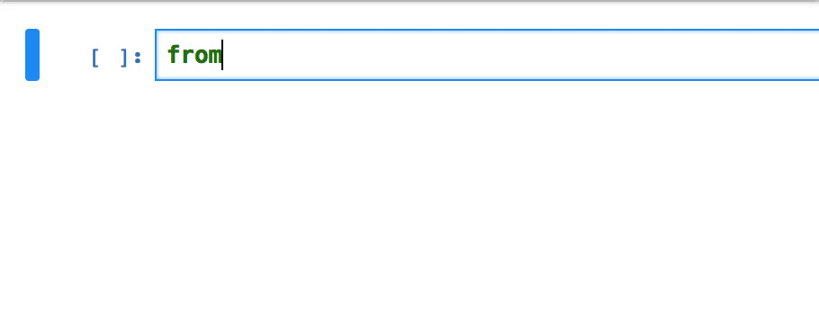

jupyterlab-data-binding
===============================

Jupyterlab data binding demo

安装
------------

直接安装编译好的版本:

    $ pip install jupyterlab_data_binding
    $ jupyter nbextension enable --py --sys-prefix jupyterlab_data_binding
    $ jupyter labextension install @jupyter-widgets/jupyterlab-manager jupyterlab-data-binding

使用源码安装:

    $ git clone https://github.com/hansnow/jupyterlab-data-binding.git
    $ cd jupyterlab-data-binding
    $ pip install -e .
    $ jupyter nbextension install --py --symlink --sys-prefix jupyterlab_data_binding
    $ jupyter nbextension enable --py --sys-prefix jupyterlab_data_binding
    $ jupyter labextension install @jupyter-widgets/jupyterlab-manager
    $ cd js
    $ jupyter labextension install .
